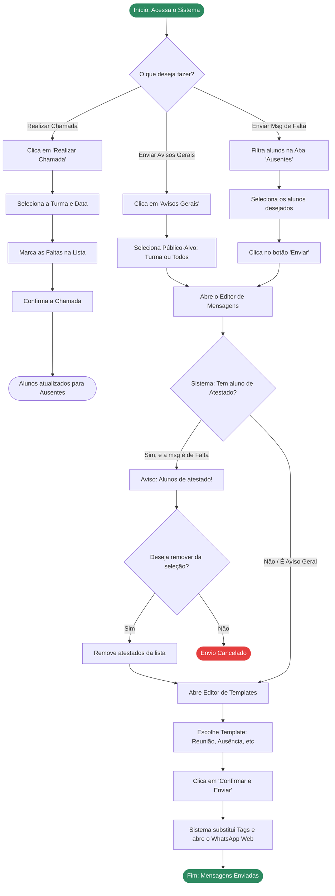

# Fluxograma do Usuário

O diagrama abaixo representa a jornada padrão de um usuário (professor ou coordenador) ao utilizar o sistema para notificar pais sobre faltas ou eventos.

## Resumo do Fluxo
A jornada foi desenhada para ser "à prova de erros". Note que o sistema sempre fará uma barreira de proteção (o losango `Tem aluno de Atestado?`) antes de permitir o envio de mensagens de ausência, garantindo que nenhum pai seja cobrado injustamente quando o filho está doente.
