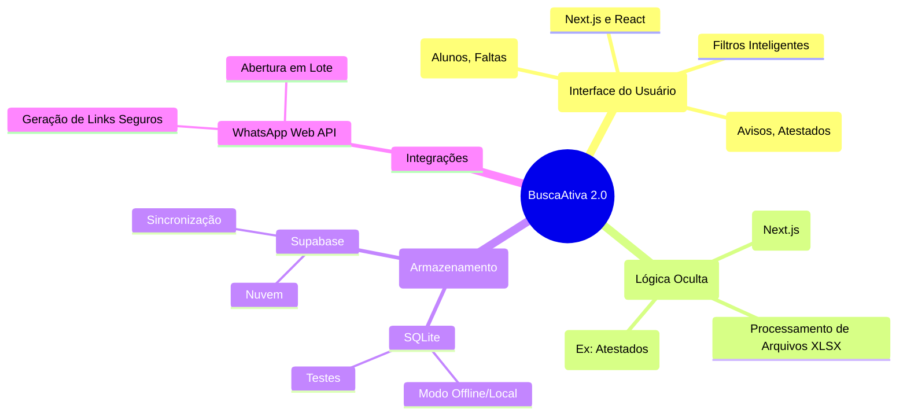

# Arquitetura Conceitual

Este mapa mental detalha como o sistema é estruturado internamente. A visualização a seguir divide a plataforma em 4 grandes áreas: Frontend, Backend, Banco de Dados e Integrações.

## Entendendo os componentes:
- **Frontend**: Tudo aquilo que o usuário clica e interage. É a nossa "vitrine".
- **Backend**: Fica escondido e processa os dados, garantindo que as regras (como não enviar mensagem de ausência para quem tem atestado) sejam cumpridas.
- **Banco de Dados**: Onde a memória da escola reside. A flexibilidade entre SQLite e Supabase permite que a escola escolha entre manter dados apenas no próprio computador ou na nuvem.
- **Integrações**: Como o sistema conversa com o mundo exterior (no caso, repassando o comando de envio para o WhatsApp).
