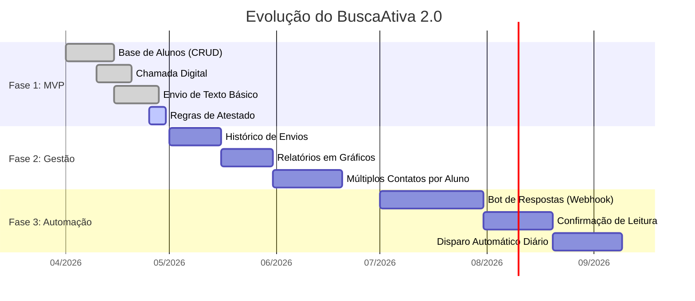

# Roadmap do Produto (Cronograma de Evolução)

O BuscaAtiva não é um sistema estático; ele é um projeto vivo! Abaixo, desenhamos a visão de futuro e as etapas de crescimento da plataforma.

## O que cada fase significa?

### Fase 1 (MVP - Produto Mínimo Viável) - *ESTAMOS AQUI!*
O objetivo era criar uma ferramenta que já trouxesse valor no primeiro dia de uso. Conseguimos fazer a gestão de chamadas, controle de atestados e o disparo facilitado de mensagens.

### Fase 2 (Gestão e Visibilidade)
O foco será criar painéis. Queremos que a direção saiba exatamente "quantas mensagens enviamos esse mês" e "quais alunos têm o maior histórico de faltas recorrentes", transformando dados em informações visuais.

### Fase 3 (A Automação Total)
No futuro, o sistema poderá operar de forma totalmente independente, enviando as mensagens automaticamente num horário programado e recebendo a resposta dos pais através de integrações oficiais com a Meta/WhatsApp, anotando no sistema se a mensagem foi lida.
